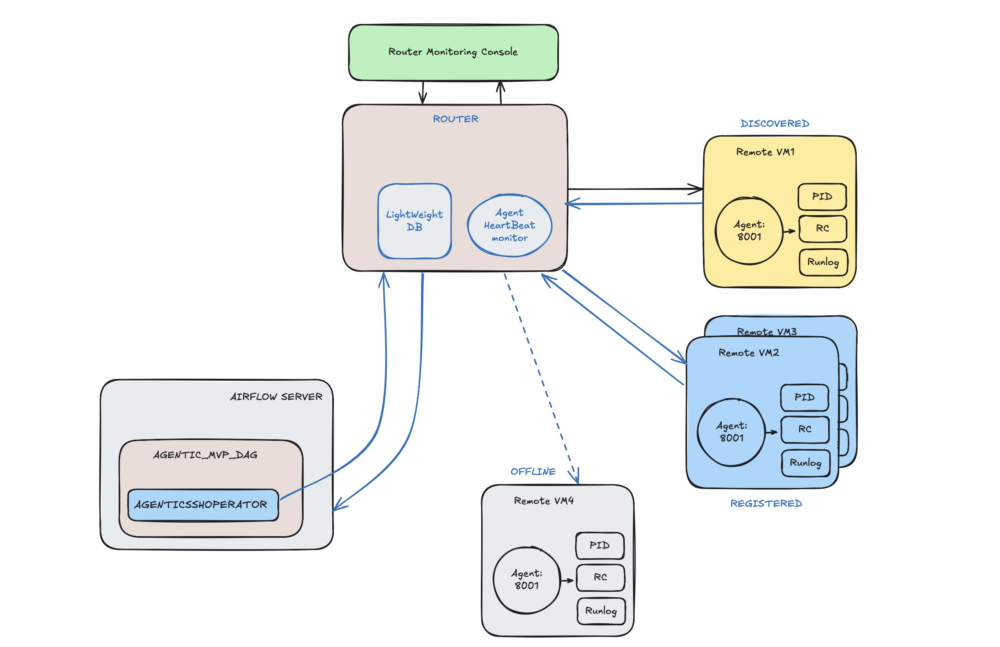

# Agentic Airflow Ecosystem: System Architecture & Quickstart



This MVP brings up **Airflow 2.10.5** (CeleryExecutor), the **Agent Router**, and one or more **Agent VMs** on a single Docker network. The Airflow plugin and demo DAG are pre-mounted for rapid experimentation.

## 0. Installation & Setup

### Prerequisites
- **Docker Desktop** (or Docker Engine + Docker Compose)
- **Git**
- **Minimum 8GB RAM** and 20GB free disk space
- **Network access** for downloading Docker images and dependencies

### Clone Repository
```bash
git clone https://github.com/KrishnaChandrasekar/rmc.git agentic-mvp
cd agentic-mvp
git checkout feature/airflowconn
```

## 1. Quickstart (Standard Build)

```bash
cd agentic-mvp
docker compose up --build -d
# Wait ~30s for airflow-init to create the admin user
```


## 2. Health Checks

```bash
curl http://localhost:8000/            # Router root -> 200
curl http://localhost:8000/health      # Router health -> {"ok": true}
curl http://localhost:8001/health      # Agent info
```


## 3. Airflow UI & Demo DAG

- Open [http://localhost:8080](http://localhost:8080)
- Login: `admin` / `admin`
- DAG: `agentic_mvp_demo` (unpause, then trigger)


The connection `agentic_ssh_default` is preconfigured via env:

```
AIRFLOW_CONN_AGENTIC_SSH_DEFAULT='http://:router-secret@router:8000'
```
The plugin uses this to submit jobs to the Router and poll status.


**Note:** The Airflow operator previously named `AgenticSSHOperator` is now called `AgenticRunOperator`. It does not use SSH, but instead runs commands or scripts on the targeted OS via the Agentic Router and Agents. Update your DAGs and plugins to use `AgenticRunOperator` for all job execution tasks.

**Ecosystem Note:** This system supports both Python-based agents and Go-based agents. You can run agents implemented in either language, and they will interoperate seamlessly within the same Agentic Router and Airflow environment.


## 4. What You'll See

- Task `run_on_vm1` runs on the Agent with hostname `vm1.local`, **detached**.
- On the Agent container: job dirs at `/app/agent_jobs/<job_id>/run.log`, `pid`, `rc`.
- Logs available via Router `/logs/<job_id>` with `Authorization: Bearer router-secret`.


## 5. Clean Build & Cache Management

### Complete System Cleanup (Fresh Start)
For troubleshooting or fresh installation, perform these steps in order:

```bash
# 1. Stop and remove all containers
docker-compose down --volumes --remove-orphans

# 2. Clean Docker system (WARNING: Removes ALL unused Docker data)
docker system prune -af --volumes

# 3. Remove specific images (optional - forces rebuild)
docker rmi $(docker images "agentic-mvp*" -q) 2>/dev/null || true

# 4. Clean npm caches
npm cache clean --force
npx clear-npx-cache 2>/dev/null || true

# 5. Clean Vite/Node.js caches (from ui/ directory)
cd ui/
rm -rf node_modules/ .vite/ dist/
cd ..

# 6. Clean browser caches
# Chrome: Ctrl+Shift+Del → "Cached images and files"
# Firefox: Ctrl+Shift+Del → "Cache"
# Safari: Develop → Empty Caches

# 7. Rebuild from scratch
docker-compose up --build
```

### Selective Cleanup Commands

**Docker Only:**
```bash
# Remove containers and volumes
docker-compose down --volumes

# Clean unused Docker data (recovers significant space)
docker system prune -f
```

**Frontend Only:**
```bash
cd ui/
rm -rf node_modules/ .vite/ dist/
npm install
cd ..
docker-compose up --build router-ui
```

**Cache Space Recovery:**
- Docker cleanup typically recovers 10-25GB
- npm cache clean recovers 1-5GB  
- Browser cache clearing recovers 500MB-2GB
- Total potential recovery: 15-30GB+

## 6. System Shutdown & Cleanup

### Graceful Shutdown
```bash
# Stop containers but preserve data
docker-compose down

# Complete removal including volumes
docker-compose down --volumes --remove-orphans
```

### Build Verification & Troubleshooting

#### Port Verification
```bash
# Check if required ports are available
lsof -i :8080,8090,8000,5555 || netstat -an | grep -E ':(8080|8090|8000|5555)'
```

#### Service Health Checks  
```bash
# Router API health
curl -f http://localhost:8000/health || echo "Router not ready"

# Airflow webserver
curl -f http://localhost:8080/health || echo "Airflow not ready" 

# React UI health
curl -f http://localhost:8090 || echo "React UI not ready"
```

#### Container Monitoring
```bash
# View all container status
docker-compose ps

# View service logs
docker-compose logs -f router         # Router API
docker-compose logs -f router-ui      # React UI  
docker-compose logs -f airflow-webserver  # Airflow
docker-compose logs -f agent          # Agent logs

# Monitor resource usage
docker stats --no-stream
```

#### Common Issues & Solutions

**Build/Startup Issues:**
- If Airflow containers fail to install packages, ensure `_PIP_ADDITIONAL_REQUIREMENTS="requests aiohttp"` is present in compose.
- If the DAG stays queued: check `router` and `agent_vm1` logs; ensure Agent publishes `host=vm1.local` and the DAG route labels include that.
- Tokens: Router expects `Authorization: Bearer router-secret`; Agent expects `X-Agent-Token: agent-secret`.

**Port Conflicts:**
```bash
# Kill processes on required ports
sudo lsof -ti:8080,8090,8000,5555 | xargs kill -9 2>/dev/null || true
```

**Memory Issues:**
```bash
# Increase Docker Desktop memory to 8GB+ via Docker Desktop → Settings → Resources
```

**Build Failures:**
```bash
# Nuclear option: complete rebuild
docker-compose down --volumes --remove-orphans
docker system prune -af --volumes
docker-compose up --build --force-recreate
```

#### System Requirements
- **RAM Usage:** 4-6GB during operation
- **Disk Usage:** 15-20GB for images and containers  
- **Network:** All services on `agentic-mvp_default` Docker network
- **CPU:** Multi-core recommended for parallel execution


## 7. Router UI

The system includes a **modern React-based UI** for monitoring jobs and agents:

### React UI - Port 8090
- **URL**: [http://localhost:8090](http://localhost:8090)  
- **Modern React.js implementation** with Vite build system
- Professional design with comprehensive filtering and analytics
- **Service**: `router-ui`

The UI provides:
- **Real-time monitoring** of jobs and agents with auto-refresh
- **Advanced filtering** with time range and timezone support
- **Job submission** and detailed log viewing
- **Analytics dashboard** with interactive charts and metrics
- **Agent management** including registration/deregistration
- **Professional design** with modern typography and responsive layout

## 8. Customization

- Add a second Agent: duplicate the `agent_vm1` block in `docker-compose.yml` with `hostname: vm2.local`, change ports to avoid conflicts, and run a second task with `route_labels={"host":"vm2.local"}`.
- Change Airflow credentials: edit the `airflow-init` command in the compose file.
- UI Development: See `ui-react/README.md` for React UI development and customization.
